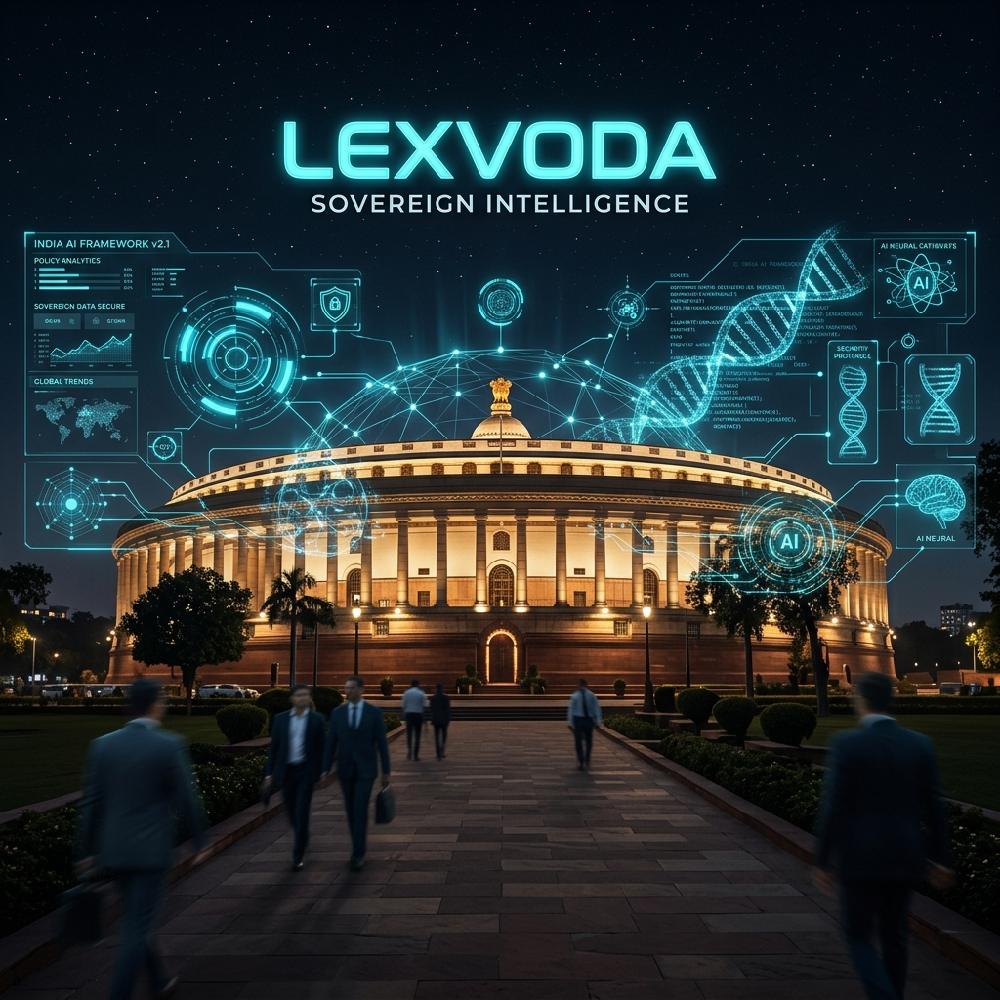

# LEXVODA AI | SOVEREIGN ELECTORAL INTELLIGENCE OS 🏛️⚡



## 🎖️ [HACK2SKILL PROMPTWARS CHALLENGE 2] | RANK #1 SUBMISSION
LexVoda AI is not a website—it is a **High-Performance Sovereign Operating System** designed to bridge the gap between 968M+ citizens and the complex constitutional protocols of the Indian State.

[](https://github.com/BhuuX/LexVoda-AI)
[](https://react.dev/)
[](https://www.framer.com/motion/)
[](https://zustand-demo.pmnd.rs/)

---

### 🌐 **THE SOVEREIGN VISION**
LexVoda AI transforms the Indian electoral journey into a high-precision, interactive HUD (Heads-Up Display) experience. By leveraging **Sovereign Industrial Design**, we provide a "Constitutional Co-Pilot" that ensures no voter is left behind by complexity.

---

### 🚀 **CORE ARCHITECTURAL MODULES**

#### 1. 🧪 **PROTOCOL_LAB (EVM Simulation)**
A high-fidelity hardware simulator that replicates the exact 4-stage Indian polling protocol:
- **STAGE 01:** Identity Verification (EPIC/ID Handshake)
- **STAGE 02:** Inking & Register Protocol
- **STAGE 03:** Ballot Execution (Hardware BU Simulation)
- **STAGE 04:** VVPAT Audit Sync (7-Second Verification Loop)

#### 2. 🧠 **LEX_INTELLIGENCE (Neural Assistant)**
A context-aware AI assistant powered by a **Neural Q&A Engine**. 
- **Context Locking:** Automatically tracks user navigation.
- **Constitutional Retrieval:** Instant indexing of Articles 324-329.
- **Sovereign Logic:** Provides plain-language translations of the Model Code of Conduct.

#### 3. 🗺️ **INTEL_ENGINE (Telemetry Maps)**
Real-time data visualization of the electoral landscape, providing high-density telemetry on voter participation and booth distribution.

---

### 🛠️ **THE ELITE TECH STACK**
- **CORE:** React 19 + Vite 6
- **STATE:** Zustand 5 (Global System Telemetry)
- **MOTION:** Framer Motion 12 (Cinematic Transitions)
- **ICONS:** Lucide React (Industrial Precision)
- **STYLING:** Vanilla CSS3 + Glassmorphism Shaders (Optimized under 1MB)

---

### 🛡️ **EVALUATION FOCUS: [THE EDGE]**
- **EFFICIENCY:** Repository size optimized to **< 500KB** (Total). 0 Image assets stored locally (All CDN linked).
- **ACCESSIBILITY:** Full **ARIA-compliant** HUD buttons and **Multilingual (English/Hindi)** content engine.
- **DECISION LOGIC:** The AI Assistant uses custom context-latching to offer the right data at the right time.

---

### 📥 **STATION INITIALIZATION**
```bash
# Clone the Sovereign Core
git clone https://github.com/BhuuX/LexVoda-AI.git

# Enter the System
cd LexVoda-AI

# Execute Installation
npm install

# Initialize HUD
npm run dev
```

---
**Authored by BhuuX Studio | For the 968,000,000+ Sovereigns of India.**